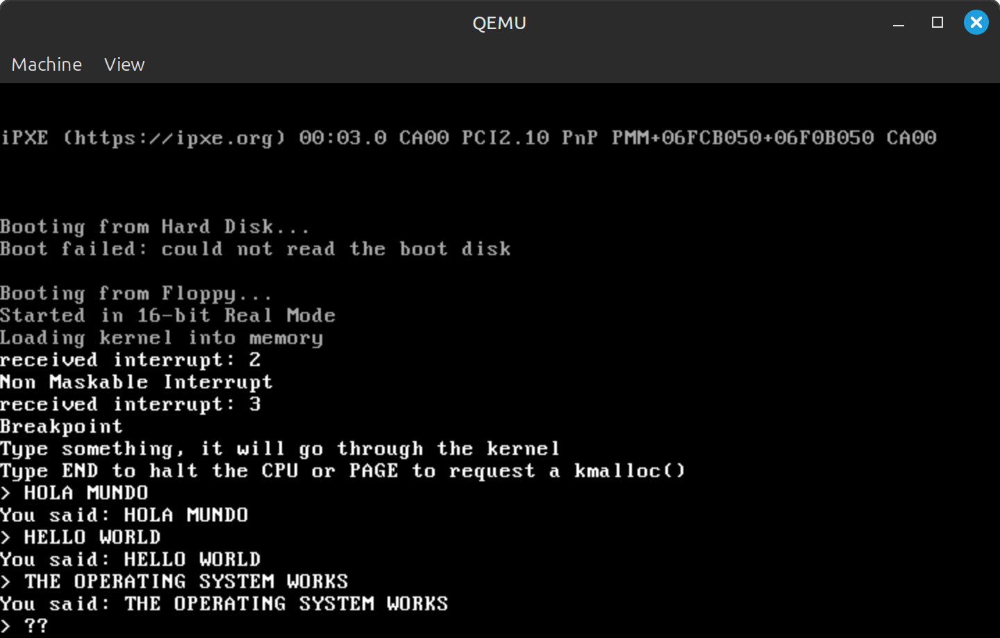

# Basic x86 Operating System


> A 32-bit operating system developed from scratch in C and Assembly.

This repository contains the source code for a minimal, monolithic x86 kernel. It was developed as the **Final Project** for the Operating Systems course at Universidad Autónoma de Guadalajara.

The primary goal of this project is not to create a full-featured consumer OS, but to demonstrate a deep understanding of low-level system architecture, memory management, and hardware interaction.

## Course Information

| Category | Details |
| :--- | :--- |
| **Institution** | Universidad Autónoma de Guadalajara (UAG) |
| **Course** | Operating Systems |
| **Professor** | Agustín Villarreal |
| **Project** | Final Project (Kernel from Scratch) |

## Implemented Features

This operating system implements the following low-level features:

* **Custom Bootloader:** Written in Assembly (NASM) to load the kernel from the disk.
* **32-bit Protected Mode:** Full transition from 16-bit Real Mode to 32-bit Protected Mode, including GDT (Global Descriptor Table) configuration.
* **C Kernel:** Core system logic written in C, linked with the Assembly entry points.
* **Interrupt Handling (IDT & ISR):** Configuration of the Interrupt Descriptor Table and Interrupt Service Routines to handle CPU exceptions and hardware interrupts.
* **Hardware Drivers:**
    * **VGA Driver:** Direct writing to video memory (`0xb8000`) with support for scrolling and cursor movement.
    * **Keyboard Driver:** User input handling via keyboard interrupts (IRQ1) and scancode translation.
* **Mini "LibC":** Custom implementation of standard C library functions, including `kmalloc`, `memcpy`, `strlen`, `hex_to_ascii`, etc.
* **Interactive Shell:** A basic command-line interface that responds to user input.

## Project Structure

The project architecture has been modularized to facilitate development and maintenance:

* `boot/`: Assembly source code for the bootloader (MBR), Protected Mode switch, and GDT.
* `kernel/`: Main kernel entry point (`main`) and high-level logic.
* `cpu/`: Low-level system management (IDT, ISR, I/O Ports, Timer).
* `drivers/`: Hardware device drivers (Screen and Keyboard).
* `libc/`: Helper libraries for string manipulation and memory management.
* `scripts/`: Automation scripts for the cross-compilation environment.
* `Makefile`: Build automation system to generate the OS image (`os-image.bin`).

## Build and Run

This project requires a specific **Cross-Compiler** (`i386-elf-gcc`), as the standard Linux compiler (`gcc`) targets the host operating system, not our standalone kernel.

### 1. Prerequisites (Linux)

We recommend using Ubuntu, Debian, or Linux Mint.

**Step A: Install Dependencies**
```bash
sudo apt update
sudo apt install build-essential bison flex libgmp3-dev libmpc-dev libmpfr-dev texinfo libncurses-dev nasm qemu-system-x86
````

**Step B: Build the Toolchain (Automated)**
We have provided a script to download and compile GCC and Binutils for the `i386-elf` architecture.

1.  Run the installation script:
    ```bash
    ./scripts/install_toolchain.sh
    ```
2.  *Please wait: This process may take 10-20 minutes.*
3.  **Important:** Close and reopen your terminal after completion to refresh your environment variables.

### 2\. Compile and Run

Use the `Makefile` to automate the build process.

**To compile and launch QEMU immediately:**

```bash
make run
```

**To clean up generated binary files (.o, .bin):**

```bash
make clean
```

## Authors

  * **Lucas Castineiras** - [GitHub: @Locas1000](https://www.google.com/search?q=https://github.com/Locas1000)
  * **Carlo Virgilio** - [GitHub: @carlovirgil](https://www.google.com/search?q=https://github.com/carlovirgil)
  * **Luis Mario Romano** - [GitHub: @LuigiSs31](https://www.google.com/search?q=https://github.com/LuigiSs31)

## Acknowledgements

This project was heavily inspired by the **"How to make an OS in C"** tutorial by Carlos Fenollosa. His guide was fundamental in understanding the foundations of this project.

  * *Reference:* [github.com/cfenollosa/os-tutorial](https://github.com/cfenollosa/os-tutorial)

Our work involved adapting the code to modern Linux environments, fixing compilation bugs, refactoring the file architecture, and implementing additional features such as memory management and improved keyboard input.